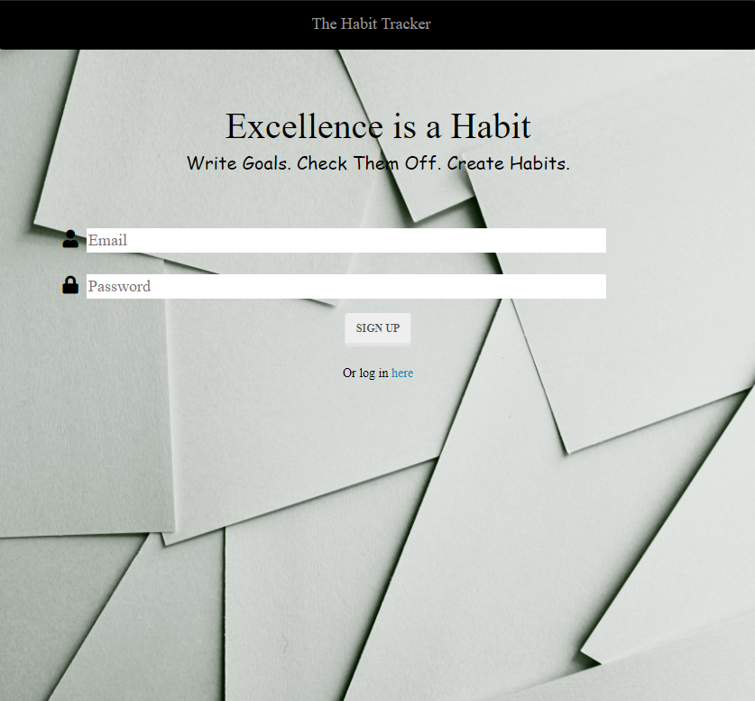

# Habit Tracker

## Description

Our habit tracker is an app that allows the user to add and track habits they are trying to create. It allows the user to see a weekly view of what habits were done on a daily basis. 



## User story

``` 
    As a person that wants to cultivate new habits to improve my well-being in 1 or more health 
    areas (financial, physical, emotional, etc)

    I want to capture and measure my habits and visualize them

    so that I can assess whether my habits are meeting the health goals I have set for myself.


```

## Table of Contents
            
* [Installation](#Installation)
* [Built With](#Usage) 
* [Contributors](#Contributors) 


## Installation

If you'd like to get a copy of the project up and running on your local machine for development and testing purposes, follow the instructions below.

### Git clone the repository to your local machine:

 git clone https://github.com/tmylessc/Project2


### Install all dependencies:

    npm install

### Run the app:

    npm start

## Built With

- [mySQL](https://www.mysql.com/)- structured query language Database
- [Node.js](https://nodejs.org/en/) - Javascript Runtime Environment
- [Bootstrap](https://getbootstrap.com/) - CSS Framework
- [npm](https://www.npmjs.com/) - Dependency management
- [Passport.js](http://www.passportjs.org/) - Authentication for Node.js
- [Handlebars.js](https://handlebarsjs.com/) - Compiles templates into JavaScript functions
- [Express.js](https://expressjs.com/) - Node.js Framework
- [Sequelize](https://sequelize.org/) - Promise-based Node.js ORM
- [jQuery](https://jquery.com/) - JavaScript library
- Javascript, HTML, CSS


## Contributors

- Thomas Coradetti (https://github.com/tmylesc)
- Jessica Perry (https://github.com/jessyoo)
- Olu Dada (https://github.com/mayodee597)
- Abby Benjamin (https://github.com/ablizben)
